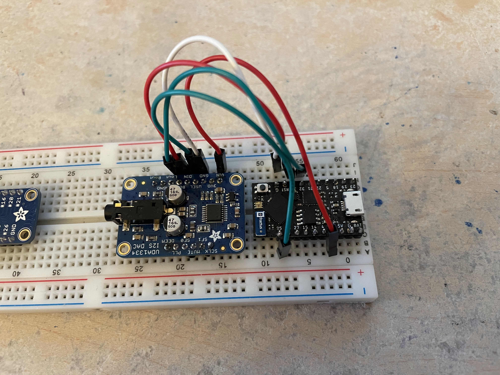

# tinysynth
## a tiny little synthesizer

Tinysynth is a synthesizer that uses the ESP32 as its audio processor.

It uses the fantastic [Arduino Audio Tools](https://github.com/pschatzmann/arduino-audio-tools) and [Arduino STK](https://github.com/pschatzmann/Arduino-STK) libraries written by Phil Schatzmann.

In my prototype, I built it on a breadboard with a [UDA1334A Breakout Board](https://www.adafruit.com/product/3678) from Adafruit.

